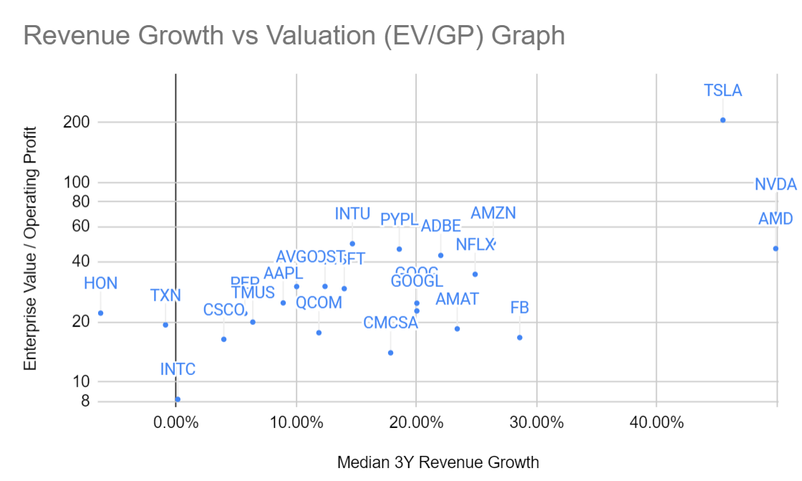

# A financial screener for public stocks and ETFs

This project was designed for my personal use to aggregate financial data from a collection of sources, calculate some new metrics, and output the data in a convenient format for using in Excel or Google Sheets. After manually collecting this data many times, I wanted to automate all of these processes to save time, improve accuracy, and provide a programmatic platform for further building off of.

[Financial Metrics Available and Data Sources](https://docs.google.com/spreadsheets/d/1DgvwIgLPSnxBZZrfBXDTJCxMmPCuiBNBMZJBUxu6hFE/edit?usp=sharing)

## Examples of Capabilities

- Among the stocks in QQQ, find the 52W drawdowns off of the highs.
```
etf = ETF('qqq')
columns = ['Ticker', '52W High']
etf.display_metrics(columns)
```

- Among the stocks in SPY, identify the stocks by the debt load.
```
etf = ETF('spy')
columns = ['Ticker', 'Debt/EBIT']
etf.display_metrics(columns)
```

- Among the Big Tech companies, list each company by the % of revenue going to Research & Development.
```
etf = ETF('aapl msft googl amzn fb')
columns = ['Ticker', 'R&D/Revenue']
etf.display_metrics(columns)
```

- Among the top holdings of ARKK, display the 3 year median quarterly revenue growth and each company's ratio EV/Gross Profit.
```
etf = ETF('arkk')
columns = ['Ticker', 'Median Rev Growth 3Y', 'EV/GP']
etf.display_metrics(columns)
```

## How to Use
In main.py, copy and paste the following (or choose any example from above):
```
etf = ETF('qqq')
columns = ['Ticker', 'Median Rev Growth 3Y', 'EV/GP', 'EV/EBITDA', 'EV/EBIT', 'EBITDA Margin', 'EBIT Margin', '52W High']
etf.display_metrics(columns)
```
_Note: The input formatting is very similar to SQL: SELECT columns FROM etf ticker name WHERE (conditionals I hope to add in the future)_
###### Console Output:
```
Ticker	Median Rev Growth 3Y	EV/GP	EV/EBITDA	Adj EV/OP	EBITDA Margin	Operating Margin	52W High	Weighting	
AAPL	8.91%	17.79	22.63	24.97	32.87%	29.80%	-11.65%	11.70%	
MSFT	13.99%	18.00	25.27	29.44	49.10%	42.10%	-15.24%	10.64%	
AMZN	26.39%	8.09	25.33	50.01	13.19%	6.20%	-23.38%	7.61%	
TSLA	45.50%	85.43	125.76	206.32	15.69%	9.60%	-25.21%	6.08%	
NVDA	49.90%	38.09	61.19	69.39	40.09%	35.30%	-32.54%	5.32%	
GOOG	20.03%		21.17	24.89	35.62%		-14.14%	3.91%	
GOOGL	20.03%	12.20	19.36	22.76	35.62%	30.30%	-13.36%	3.66%	
FB	28.59%	9.23	15.31	16.73	48.75%	41.80%	-19.68%	3.31%	
ADBE	22.02%	17.99	39.84	43.21	39.84%	32.60%	-25.71%	2.08%	
NFLX	24.88%	17.91	12.47	34.74	63.46%	21.20%	-44.77%	1.85%	
COST	12.39%	8.10	23.98	30.21	4.32%	3.40%	-14.45%	1.55%	
CSCO	3.97%	7.16	14.81	16.40	30.79%	27.00%	-11.49%	1.51%	
CMCSA	17.85%	4.24	9.61	14.03	29.35%	17.50%	-18.98%	1.49%	
AVGO	10.03%	15.25	17.65	30.16	53.04%	31.00%	-20.09%	1.48%	
PEP	5.72%	6.52	19.10	22.14	18.40%	14.60%	-2.21%	1.44%	
PYPL	18.57%	16.74	36.26	46.47	22.06%	17.00%	-47.71%	1.42%	
QCOM	11.88%	10.03	17.01	17.69	33.90%	29.10%	-12.14%	1.33%	
INTC	0.14%	4.79	6.60	8.20	40.87%	25.90%	-24.16%	1.30%	
AMD	49.89%	20.25	40.80	46.76	23.23%	19.90%	-29.14%	1.25%	
INTU	14.67%	18.28	53.01	49.46	28.29%	24.10%	-25.41%	1.16%	
TXN	-0.88%	13.71	17.31	19.36	52.59%	47.00%	-11.83%	1.16%	
HON	-6.28%	13.05	19.36	22.19	21.77%	20.60%	-13.68%	0.91%	
TMUS	6.38%	4.52	8.44	20.01	30.46%	9.50%	-28.99%	0.89%	
AMAT	23.39%	11.69	17.51	18.51	31.57%	29.90%	-16.62%	0.87%
```
###### In Google Sheets: 


## Current Capabilities
#### Pulls financial metrics for individual stocks from different sources
- Examples from [Finviz](https://finviz.com/quote.ashx?t=AAPL): Market Cap, Revenue, P/E, P/S, Gross/Operating/Net Margins, Drawdown from 52W High, Stock Performance Data
- Examples from [Macrotrends](https://www.macrotrends.net/stocks/charts/GOOGL/alphabet/revenue): Quarterly Revenue, EBITDA (and EBITDA Margin), Cash/Debt, historical P/S, PE Ratio
#### Pulls ETF holdings data from [Marketwatch](https://www.marketwatch.com/investing/fund/qqq/holdings)
#### Calculates aggregate ETF metrics based on the financial metrics of the underlying holdings
- Example: Calculate "Weighted Average Revenue Growth" for QQQ, SPY, or VIG
#### Calculates new financial metrics (not found in any of the data sources)
Example: Calculate the "Median 3Y Quarterly Revenue Growth" and the "Enterprise Value to EBIT ratio" for the holdings of QQQ
1. Look up QQQ holdings in Marketwatch (top 25)
2. For each of these stocks, pull the last 3 years of quarterly revenue growth rates from Macrotrends. Calculate the medians.
3. Pull the market caps from finviz. Pull the cash, debt, revenue, and operating (EBIT) margin from Macrotrends. Calculate the individual EVs, then EV/EBIT ratios.
4. Using the Median 3Y Quarterly Revenue Growth" and "Enterprise Value to EBIT ratio" for each of the individual holdings, calculating the weighted metric for the overall ETF.
#### Outputs results in an Excel-friendly tab-delimited format
- Can just simply copy/paste the data into Excel or Google Sheets to graph the results. In the long-run, I can automate this too if I wanted but the time savings here isn't worth automation yet...

## Current Data Sources
[Data Sources](https://docs.google.com/spreadsheets/d/1DgvwIgLPSnxBZZrfBXDTJCxMmPCuiBNBMZJBUxu6hFE/edit?usp=sharing)
- Yahoo finance (from the Yahoo Finance and yfinance Python libraries)
- Finviz finance (from the finviz Python library)
- Macrotrends (scraped from the website using requests library)
- Marketwatch (scraped from the website using requests library)

## Required Libraries to Pip Install
- requests
- yfinance
- yahoofinance
- finvizfinance

## Future Goals
- Improve data sources for international stocks
- Add conditional statements for filtering lists of stocks (e.g. show revenue growth for QQQ holdings where Operating Margin > 10%)
- Review and add more error handling


